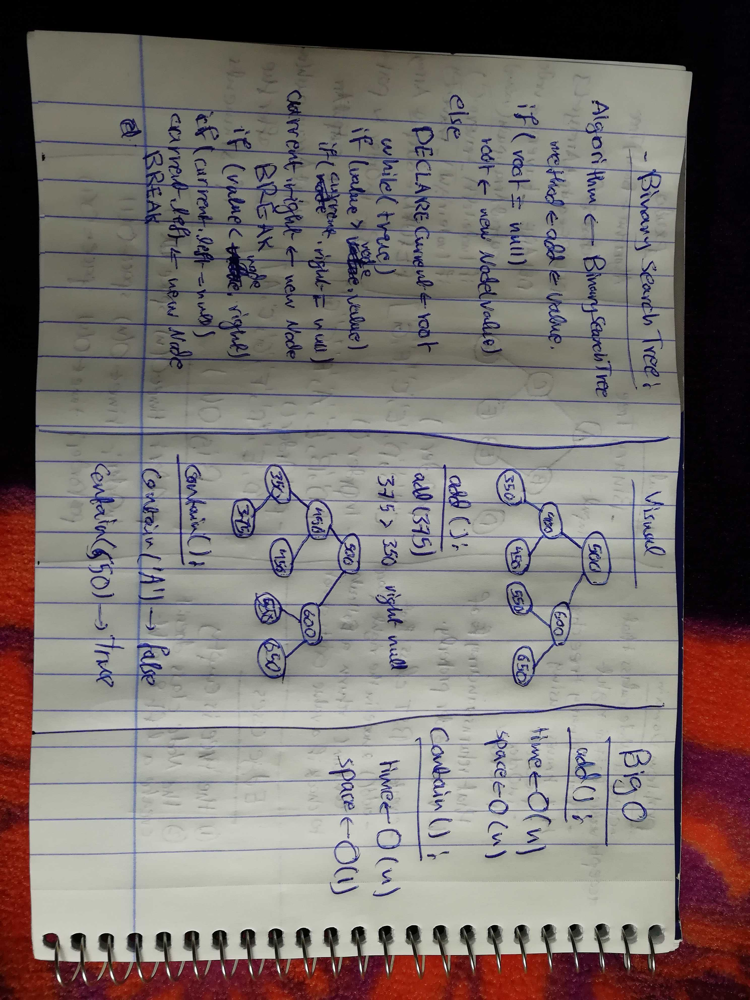
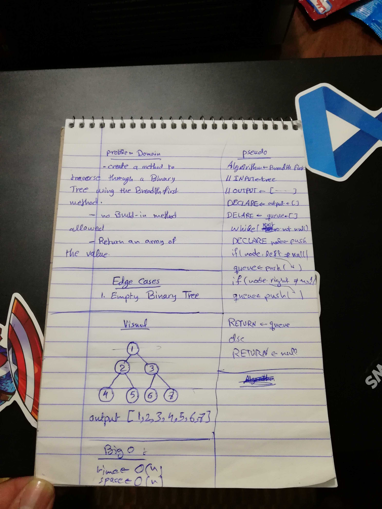
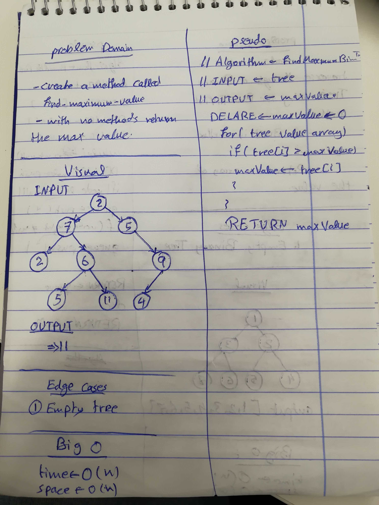

# Challenge 18

# Find Maximum Value

# Challenge Summary
this challenge is about working with Binary trees, and Binary search trees, by creating a Node class that instantiate a new node with left and right, fot the child nodes, also work with Binary Search Trees.

also the breadth first traversal methods, in which traverses through binary tree in a height method.

and also a method is created to find the max value in a Binary tree, in which it loops in the array that is an output from a pre-defined method, and return the Max value from that array.

## Challenge Description
create a node class that instantiate a node with left and right, create methods that traverse through the Tree, using the depth first approach, the preOrder, inOrder, and postOrder methods are used. and for the binary search tree create a method that adds a node in the right place, and a method called contain that returns a Boolean if the value exists in the tree or not.

create a traverse method that is based on the breadth first traverse method. 

and finally a method to return the maximum value, a tree.

## Approach & Efficiency
in the binary tree traversing methods, the recursion method is used, by following the ordering of the traverse methods. and for the Binary search Tree, a lot of conditions and while loops are used.

in the traverse method, if statements and while loop is used.

in the max value method a is created to return the max value in a tree.

### Big O
  #### Binary Trees
   ##### preOrder()
    time O (n)
    space O (1)
    the time is O(n), because of recursion, and the space O(1), because no operations are done for the variables.
   
   ##### inOrder()
    time O (n)
    space O (1)
    the time is O(n), because of recursion, and the space O(1), because no operations are done for the variables.
    
   ##### postOrder()
    time O (n)
    space O (1)
    the time is O(n), because of recursion, and the space O(1), because no operations are done for the variables.

   #### Binary Search Tree
    ##### add()
     time O (n)
     space O (n)
     the time is O(n), because of the while loop, and the space is O(n), because of operations done to the current variable.

     ##### contain()
      time O (n)
      space O (1)
      the time is O(n), because of the while loop, and the space is O(1), because no variables are used just returning a Boolean. 

    #### Breadth First 
     ##### breadthFirst()
      time O (n)
      space O (n)
      the time is O(n), because of the while loop, and the space is O(n), because arrays are used.

    #### Find Max Value
     ##### findMaxValue()
      time O (n)
      space O (n)

## Solution

