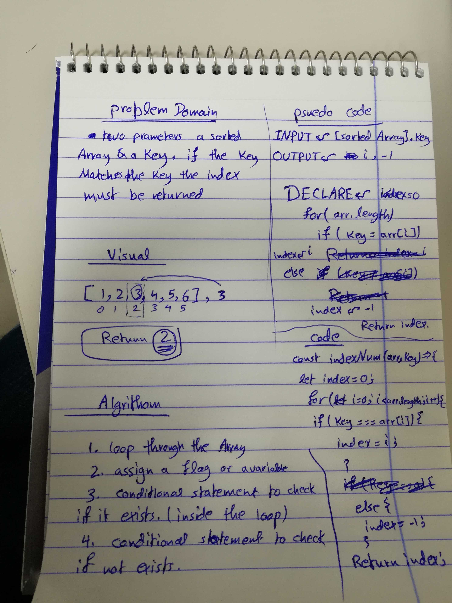

# Challenge 03

# Array Binary Search 

# Challenge Summary
Use the Binary Search Method, to search in an array in a faster more efficient way with a Big O (1), at best cases.

## Challenge Description
the challenge is a simple straight forward challenge, it's requirement is to use binary search methodolgy to search a large array in a much faster more efficient way, without using any JS Built-in methods.

## Approach & Efficiency
used the very basic hard coding style of solving the problem, by using a for-loop, if statements and dividing the array into halves.

### Big O
time O (n)
space O (n)

## Solution

