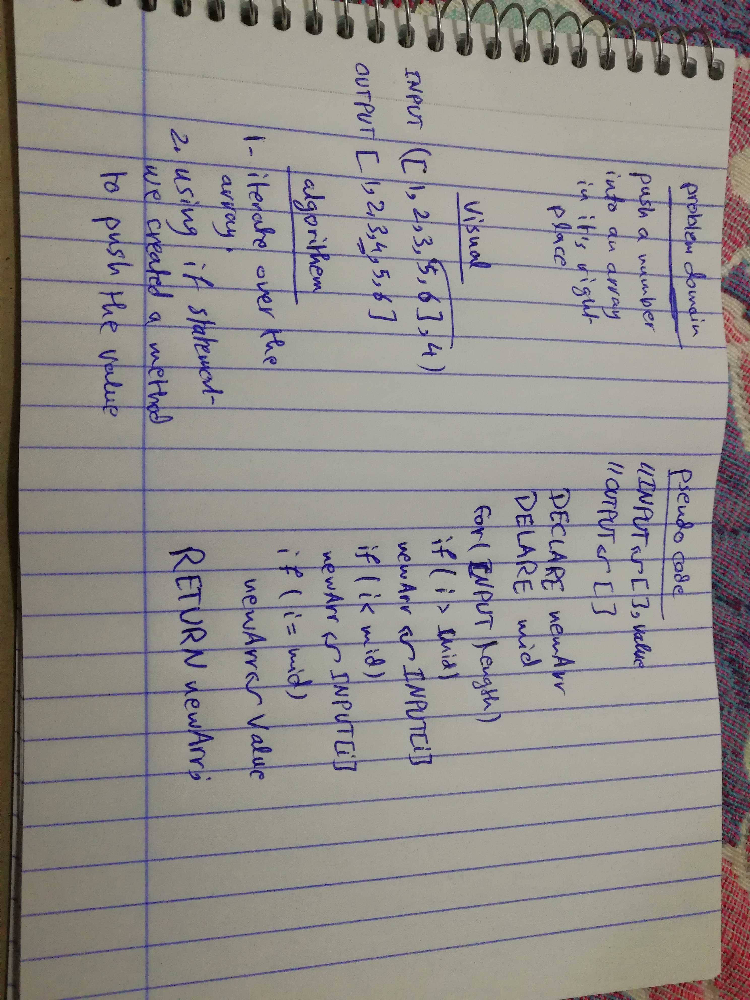

# Challenge 02 

# Array Shift

# Challenge Summary
the challenge is a simple straight forward challenge, it's requirement is to shift an array and push an element to the middle of an array, without using any JS Built-in methods.

## Challenge Description
it is a challenge, to manipulate the content of an array, without using any built-in methods that JS offers.

## Approach & Efficiency
used the very basic hard coding style of solving the problem, by using a for-loop and if statements.

### Big O
time O (n)
space O (1)

## Solution
