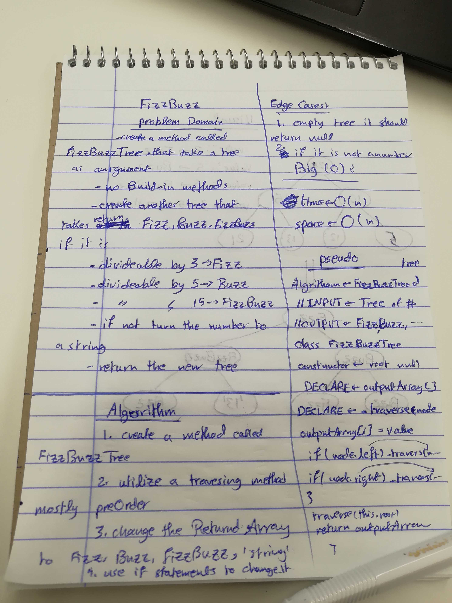
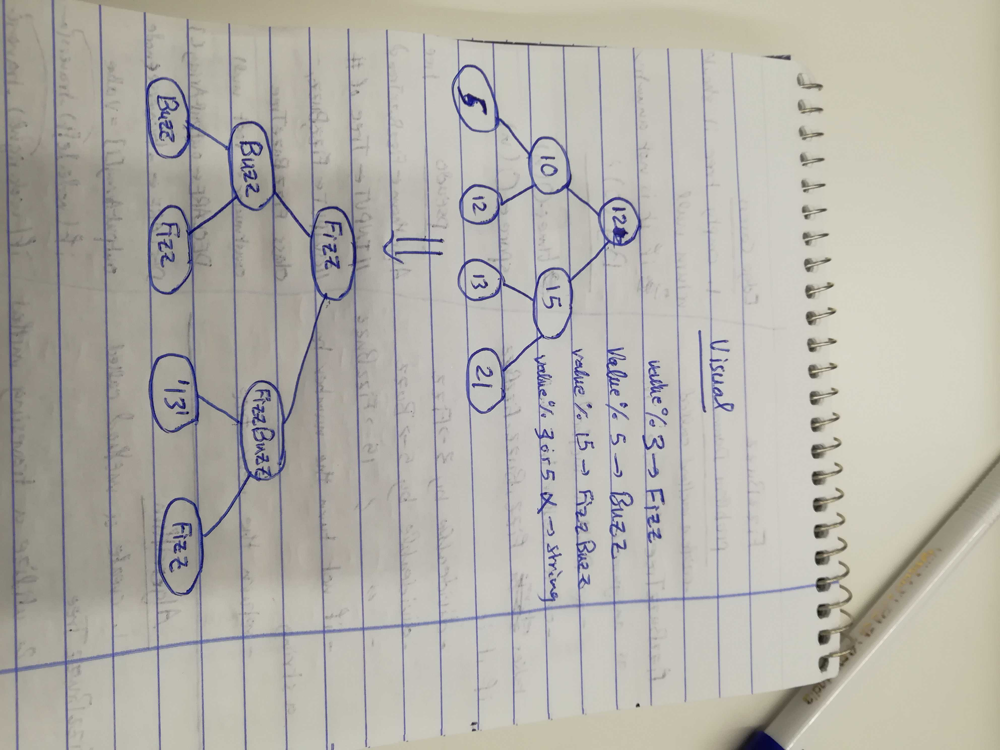

# Challenge 16

# Fizz Buzz Tree

# Challenge Summary
this method is about modifying an existing Binary tree based on the FizzBuzz problem, if the node's value is dividable by 3 change the value to fizz, by 5 to buzz, 15 to fizzBuzz, and if not return the value as a string.  

## Challenge Description
create a method that accepts a binary tree, checks if the value is dividable by 3 return fizz, 5 return buzz, both return fizzBuzz, or not dividable by 15 return the value as a string.
## Approach & Efficiency
taking aspiration from code challenge 15, using the preOrder method. 

### Big O
time O (n)
space O (1)
the time is Big O(n), because of the recursive function, and the space is a big O(1) because no operations are done on a variable 

## Solution

