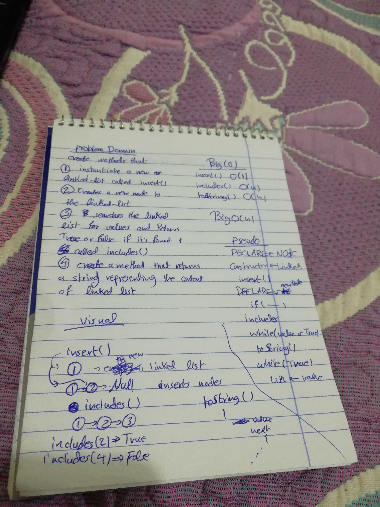
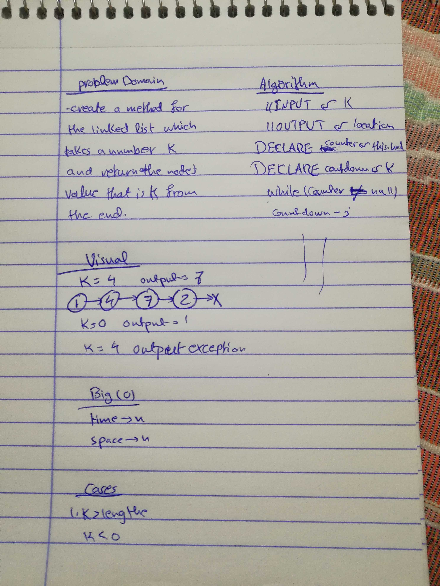

# Challenge 05 

# Singly linked Lists

# Challenge Summary
data structure is a new topic, in this challenge we learned how to instantiate new node, some basic operations on nodes and how to represent then in strings.

## Challenge Description
Linked List... this challenge is about Linked Lists and how to instantiate a new linked list , how to check for values, hot to test them and how to show  them as strings.

## Approach & Efficiency
The class module is used in this challenge, with constructor and the insert(), include() and toString() methods are used. the approach is using vanilla JS, to work with linked lists, for while loops and if statements are used.

### Big O
   #### insert():
    time O (1)
    space O (1)
    no iterations are used it is a straight forward method to insert a node at the end of the linked list.

   #### includes():
    time O (n)
    space O (1)
    the time is a big O(n) because in the worst case the method may iterate over the entire linked list

   #### toString():
    time(n)
    space(1)
    in the worst case it may iterate over the entire the linked list.

## Solution

===================================================================================================================

# Challenge 06

# Linked List insertions 

# Challenge Summary
a challenge for inserting nodes, in multiple places before and after a specific node at the end or the beginnin.

## Challenge Description
insert nodes at the end or before or after a specific node.

## Approach & Efficiency
the append(), insertBefore() and insertAfter() methods are added to the class to append nodes, or adding them in a specific location. 

### Big O
   #### append():
    time O (1)
    space O (1)
    no iteration is done is the Big O(1) is present.
   
   #### insertBefore():
    time O (1)
    space O (n)
    higher order functions are used.

   #### insertAfter():
   time O (1)
   space O (n)
   higher order functions are used.

## Solution

======================================================================================================================

# Challenge 07

# Linked List CountBack 

# Challenge Summary
a challenge for looping through the linked list in a reverse manner, get the correct values, and checks for abstract situations. 

## Challenge Description
loop through the linked list in a reverse manner to get specific values.

## Approach & Efficiency
the llkthFromEnd(), is a method built by using while loop, and if statements. to loop through the array in a reverse manner. 

### Big O
time O (n)
space O (n)

## Solution
