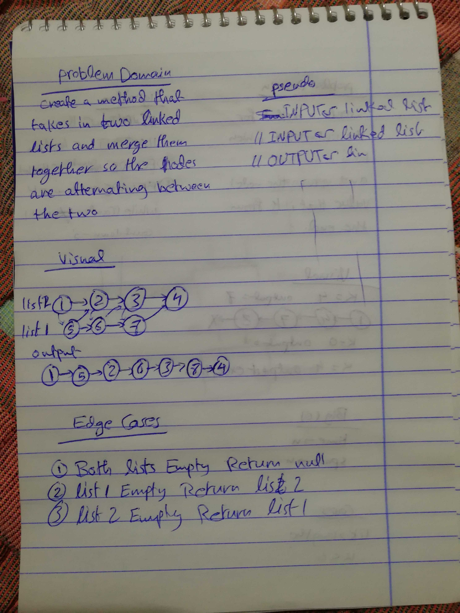

# Challenge 08

# Linked List Merge

# Challenge Summary
this challenge is based on merging two different lists together, and arranging the content of the linked list on alternating fashion.

## Challenge Description
create a function that accepts two linked lists, zip these two linked lists together and arrange the nodes on alternating fashion.

## Approach & Efficiency
the approach was eliminating the edge cases first, then checking for linked lists length then arrange then on alternating fashion.

### Big O
   #### mergeList()
    time O (n)
    space O (1)
    time is a big O(n), because there is a while loop that will loop through the linked list, but this while loop swap between the two loop.

## Solution

