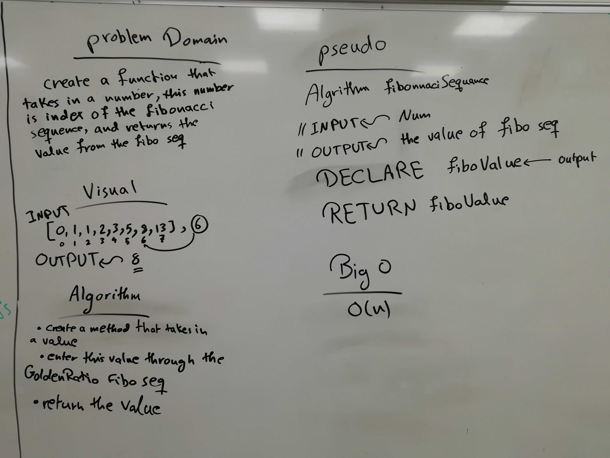
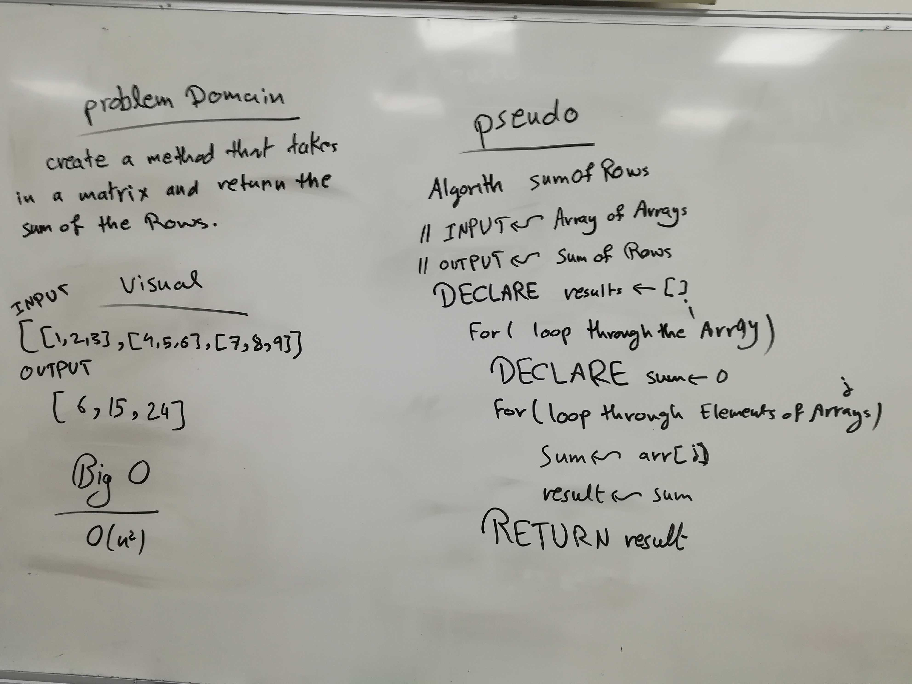

# Challenge 04

# Mock Interview-Fibonacci sequence 

# Challenge Summary
this was a mock interview code challenge but it was changed to a straight code challenge, the Fibonacci sequence is the star of the show.

## Challenge Description
the code challenge is when a number is entered, a fibonacci sequence is created and the value of the number is the index of a fibonacci sequence value, of course without using any built-in methods that JS offers.

## Approach & Efficiency
the approach is either to use for loops or hard coding, or using the Fibonacci Golden Ratio Formula.

### Big O
time O (n)
space O (1)

## Solution

