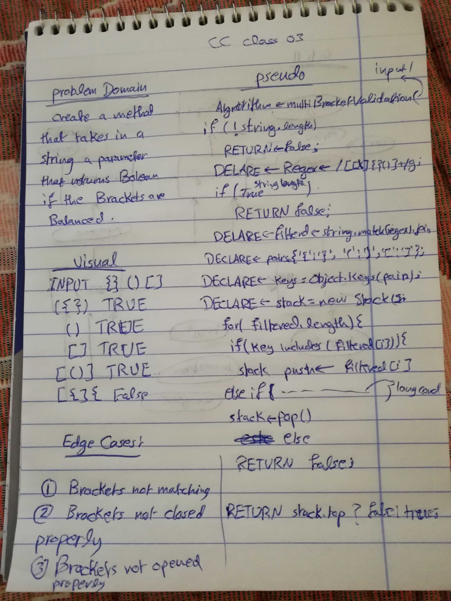

# Challenge 13

# Multi Bracket Validator 

# Challenge Summary
this challenge is about validating brackets pairs, making sure that the brackets are balanced, and no brackets, curly braces or square braces. are not open and closed well.  

## Challenge Description
create a function that validates balanced brackets, of all types. and validate that the brackets and opened and closed correctly also the placement of the opening and closing is correct.

## Approach & Efficiency
used hard coding, and regex as conditions for the if statements.   

### Big O
time O (n)
space O (n)
because of hard coding, a for loop is used so the big O is O(n).

## Solution

