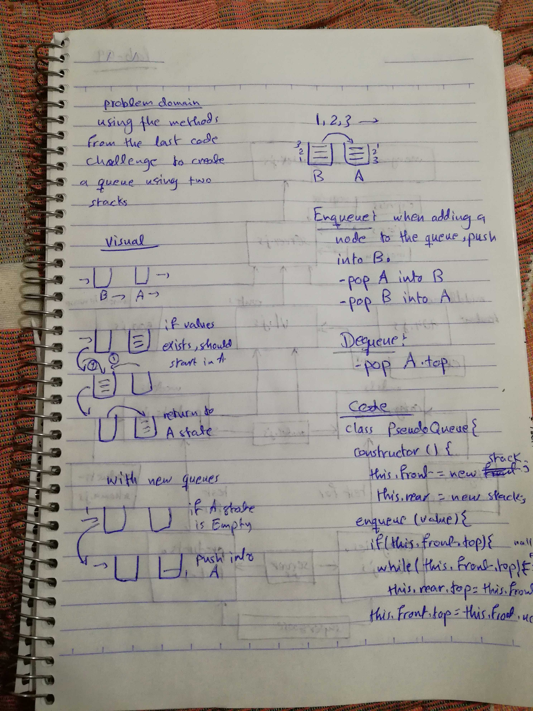

# Challenge 10

# Queues with Stacks

# Challenge Summary
this challenge is built on the previous Code challenge, using the enqueue and the dequeue methods, and the other created methods.

## Challenge Description
this challenge is for implementing queue with two stacks, using the previous methods created, enqueue and dequeue.  
## Approach & Efficiency
this code challenge is based on the last code challenge, using the methods to create a queue with stacks, so the pre defined methods are used.

### Big O
   #### enqueue()
    time O (1)
    space O (1)
    because the push method used which had a Big O of 1 for both time and space.
   #### dequeue()
    time O (n)
    space O (n)
    because of iterating through the stacks and queues. 

## Solution

