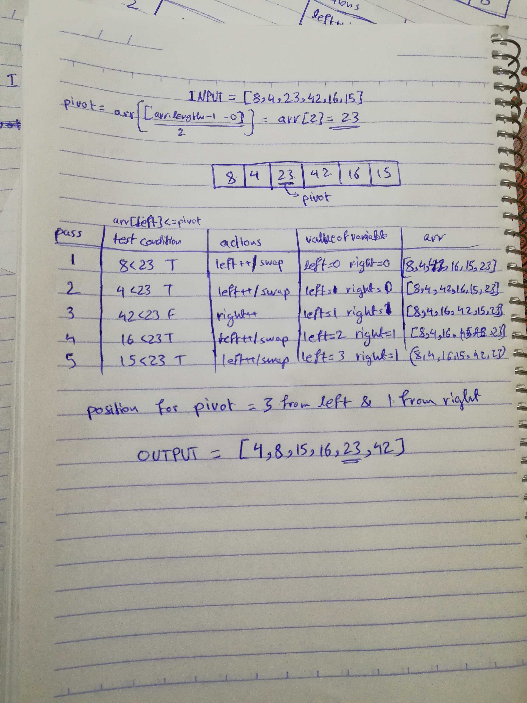

ALGORITHM QuickSort(arr, left, right)
    if left < right
        // Partition the array by setting the position of the pivot value 
        DEFINE position <-- Partition(arr, left, right)
        // Sort the left
        QuickSort(arr, left, position - 1)
        // Sort the right
        QuickSort(arr, position + 1, right)

ALGORITHM Partition(arr, left, right)
    // set a pivot value as a point of reference
    DEFINE pivot <-- arr[right]
    // create a variable to track the largest index of numbers lower than the defined pivot
    DEFINE low <-- left - 1
    for i <- left to right do
        if arr[i] <= pivot
            low++
            Swap(arr, i, low)

     // place the value of the pivot location in the middle.
     // all numbers smaller than the pivot are on the left, larger on the right. 
     Swap(arr, right, low + 1)
    // return the pivot index point
     return low + 1

ALGORITHM Swap(arr, i, low)
    DEFINE temp;
    temp <-- arr[i]
    arr[i] <-- arr[low]
    arr[low] <-- temp
---------------------------

The above pseudo code is for the quick sort method, that works on the idea of divide and conquer, it find an element named pivot which divides the array into two parts, in which values lower than pivot are located on the left and higher than pivot are on the right. 

 The recursively we do:
 1. Bring the pivot to its appropriate position, left of the pivot smaller, right of the pivot is larger.
 2. quick sort the left.
 3. quick sort the right. 

 In the code i specified the the pivot pint to be the middle point, because of Maximum stack error. 

  A Visual representation is provided some details

  

