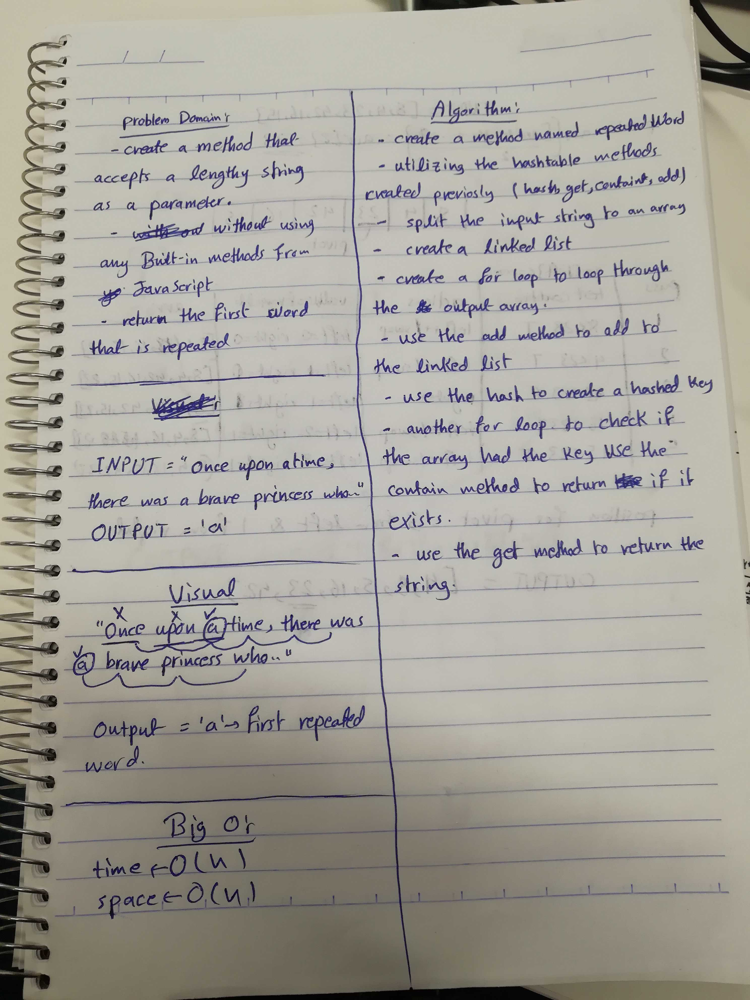

# Challenge 31

# Repeated Words

# Challenge Summary
This challenge is about finding the repeated words in a string, using hash tables is a good idea. 

## Challenge Description
create a method that accepts a lengthy string and returns the first repeated word in the string. covering all cases of a trailing period and comma, to capitalization.  

## Approach & Efficiency

### Big O
 #### repeatedWord()
  time O (n)
  space O (n)
   Big O is O(n), in Both cases because of the for loop, and the need to loop through the split string. to finish the method.

### Acknowledgments
- [Qusai-Al-Hanaktah](https://github.com/Qusai-alhanaktah)

### worked as a pair
- Qusai A. Al-Hanaktah
- Ahmad K. Al-Mahasneh

## Solution
